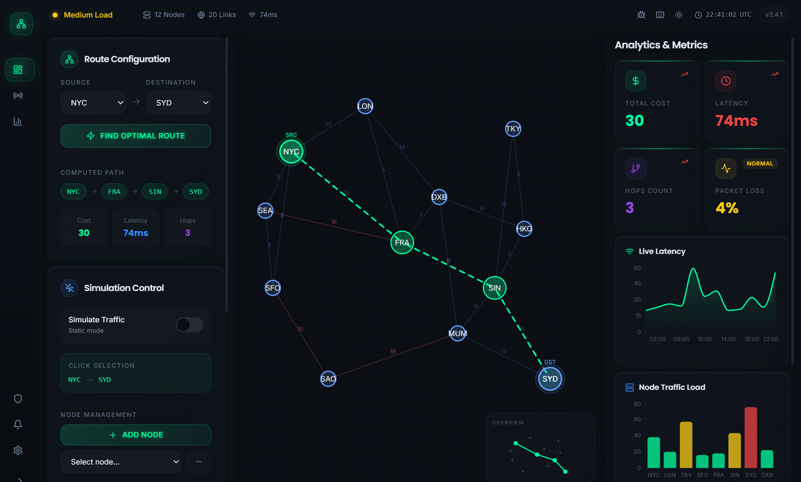
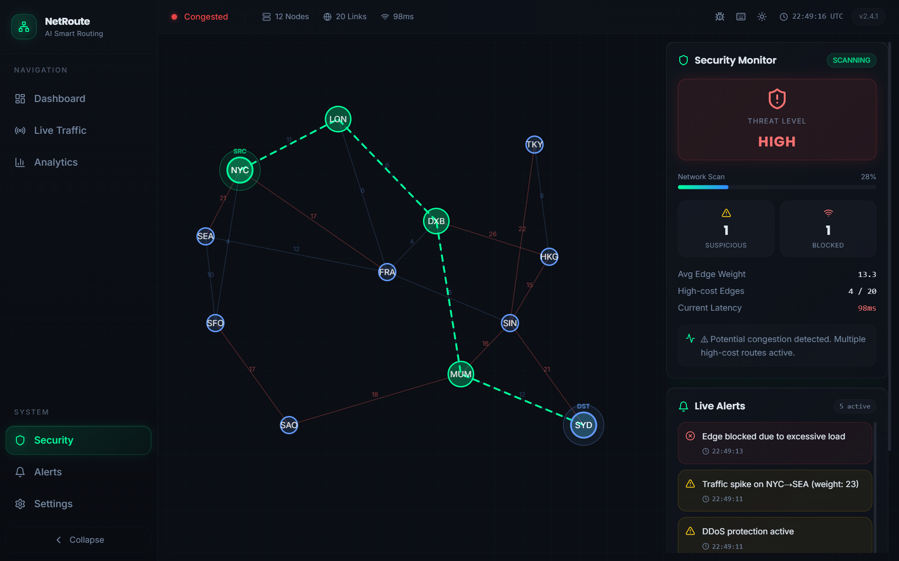
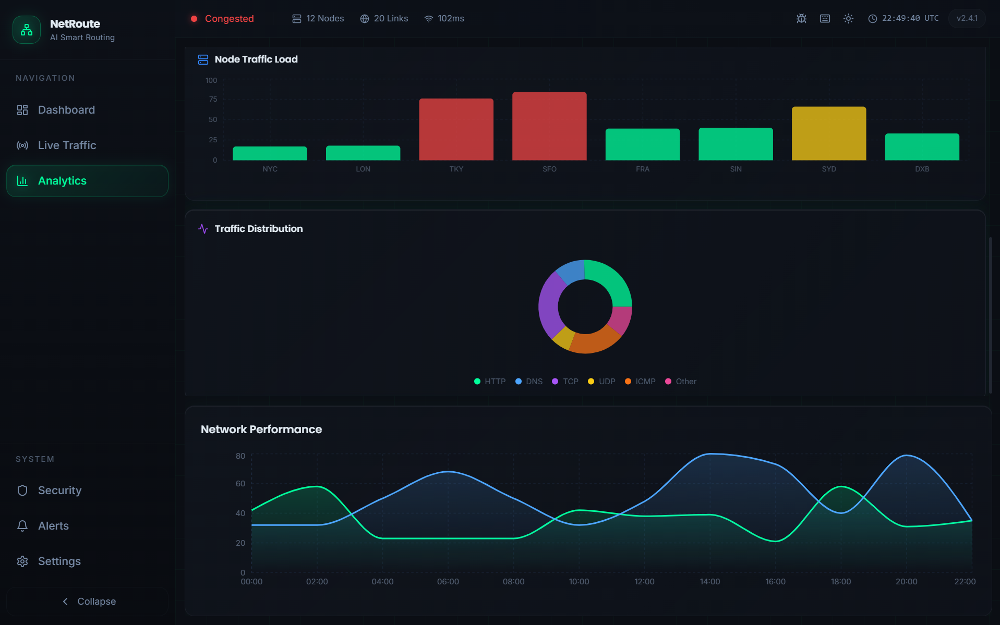

# 🚦 Smart Traffic Routing System

An interactive **network traffic visualization and routing dashboard** that simulates real-time traffic flow, path optimization, and network analytics.

---

## 🧠 Overview

This project demonstrates how traffic flows through a network and how optimal routes are calculated and visualized.

It combines:

* **Graph algorithms**
* **Real-time simulation**
* **Modern UI/UX design**

---

## ✨ Features

* 🌐 **Interactive Network Graph**

  * Nodes and edges visualization
  * Animated packet movement
  * Dynamic path highlighting

* ⚡ **Traffic Simulation**

  * Simulate real-time traffic flow
  * Toggle between static and dynamic modes

* 📊 **Analytics Dashboard**

  * Traffic distribution (donut chart)
  * Network load (bar chart)
  * Real-time metrics

* 🧭 **Path Optimization**

  * Visual shortest path rendering
  * Step-by-step route reveal

* 🎯 **Modern UI**

  * Glassmorphism + neon theme
  * Smooth animations
  * Responsive layout

---

## 🛠 Tech Stack

* **Frontend:** React + TypeScript
* **Build Tool:** Vite
* **Styling:** Tailwind CSS
* **UI Components:** shadcn/ui + Radix UI
* **Charts:** Recharts
* **State & Data:** React Query

---

## 🚀 Getting Started

### 1. Clone the repository

```bash
git clone https://github.com/qn-spadez/smart-traffic-routing-system.git
cd smart-traffic-routing-system
```

### 2. Install dependencies

```bash
npm install
```

### 3. Run the development server

```bash
npm run dev
```

👉 Open: `http://localhost:8080`

---

## 📁 Project Structure

```
src/
 ├── components/
 │    ├── dashboard/
 │    ├── ui/
 │
 ├── hooks/
 ├── lib/
 ├── pages/
 ├── App.tsx
 └── main.tsx
```

---

## 📸 Screenshots






---

## 🎯 Use Cases

* Learning **graph algorithms & networking concepts**
* Demonstrating **traffic routing systems**
* Portfolio project for **frontend / systems design**

---

## ⚠️ Known Issues

* Browser caching may delay favicon updates (dev only)
* Simulation performance depends on number of nodes

---

## 🔮 Future Improvements

* Backend integration (real traffic data)
* AI-based route optimization
* Multi-network simulation
* User-configurable topology

---

## 👨‍💻 Author

**Sheetal Gupta**

---

## 📄 License

This project is open-source and available under the MIT License.
